# 🛒 Laza Shop App


---

## 📝 Overview

**Laza Shop App** is a production-ready, feature-rich e-commerce application built with **Flutter**. It provides a fully responsive UI designed for phones, tablets, and web browsers, featuring comprehensive multi-language support (English & Arabic with automatic LTR/RTL layout direction), dynamic theme management (Light & Dark mode), and robust state management following the **BLoC Architecture Pattern**.

---

## 📸 App Screenshots

All 13 application screens and user flows are presented below:

### 📱 Authentication & Home Screen
| 1. Sign Up Screen | 2. Home Screen (Light) | 3. Responsive Product Grid | 4. Search & Filters |
| :---: | :---: | :---: | :---: |
| 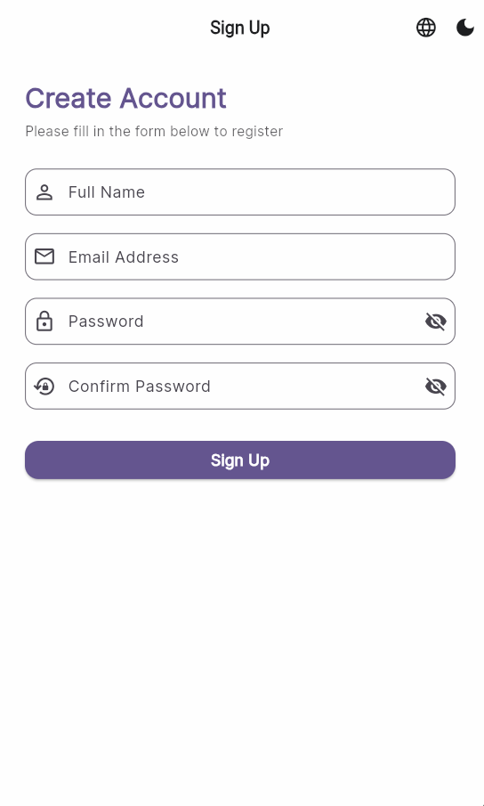 | 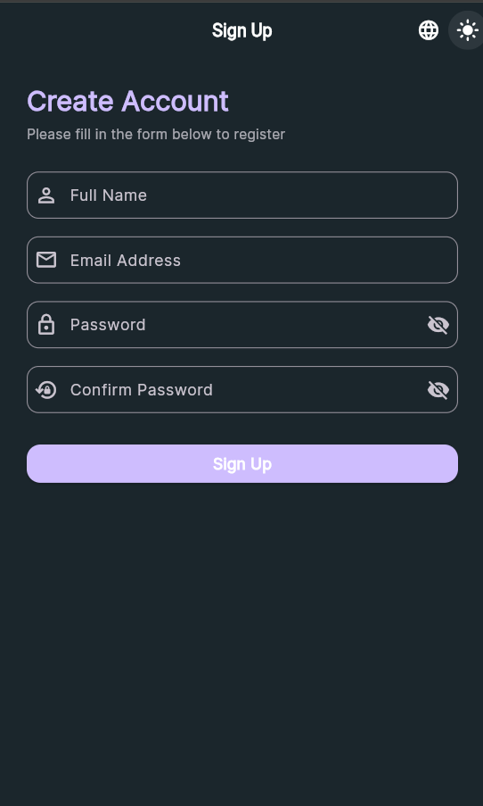 | 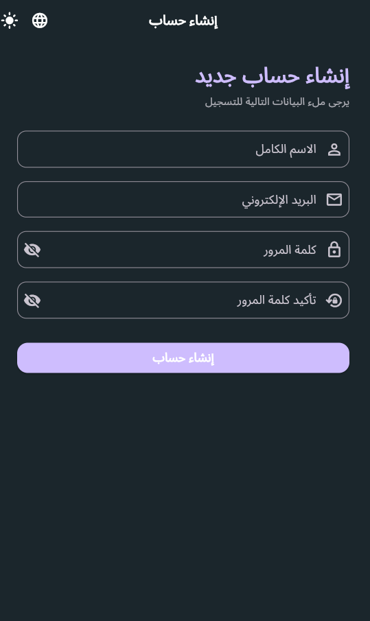 | 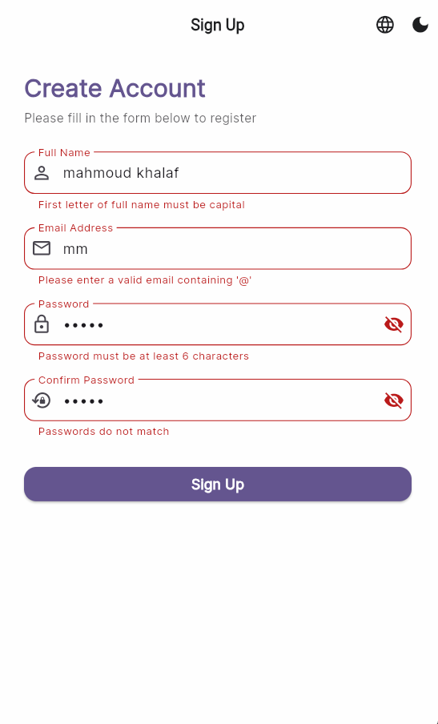 |

### 🛍️ Product Details & Shopping Cart
| 5. Product Details | 6. Add to Cart | 7. Cart Screen | 8. Order Summary |
| :---: | :---: | :---: | :---: |
| 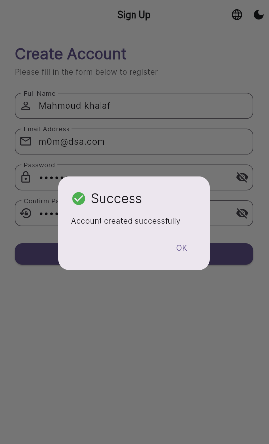 | 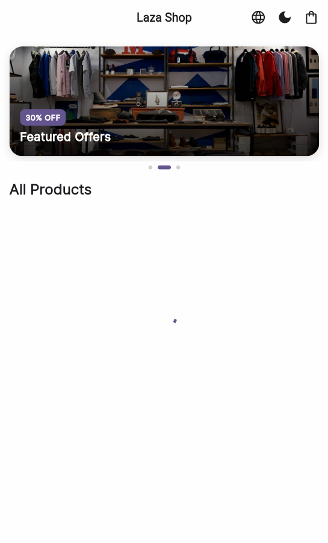 | 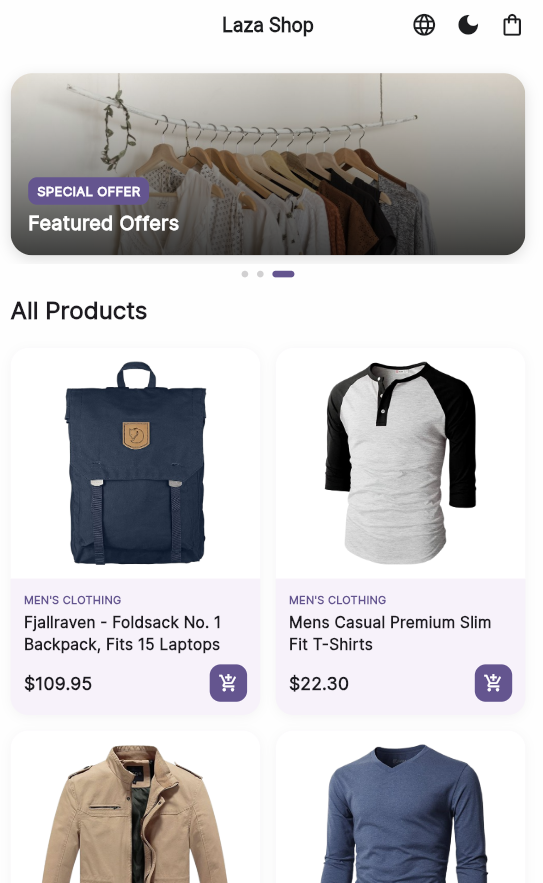 | 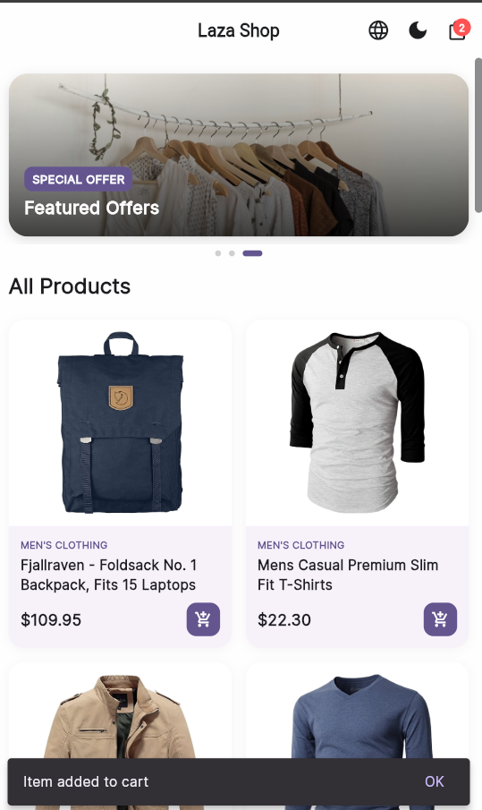 |

### 🌙 Dark Theme & Arabic Localization
| 9. Arabic - Home | 10. Arabic - Details | 11. Dark Theme - Home | 12. Dark Theme - Cart | 13. Empty Cart State |
| :---: | :---: | :---: | :---: | :---: |
| 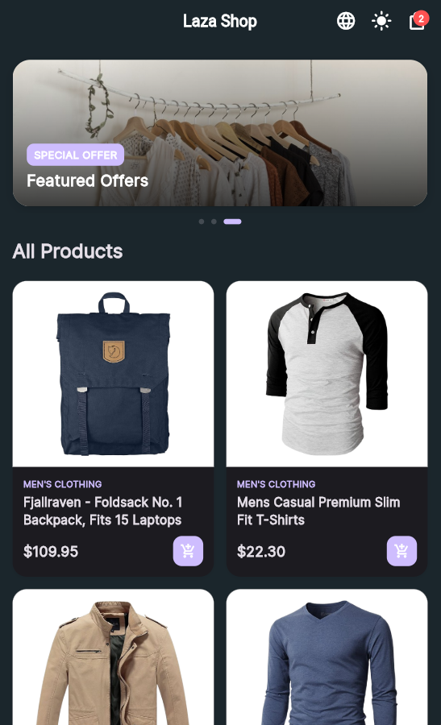 | 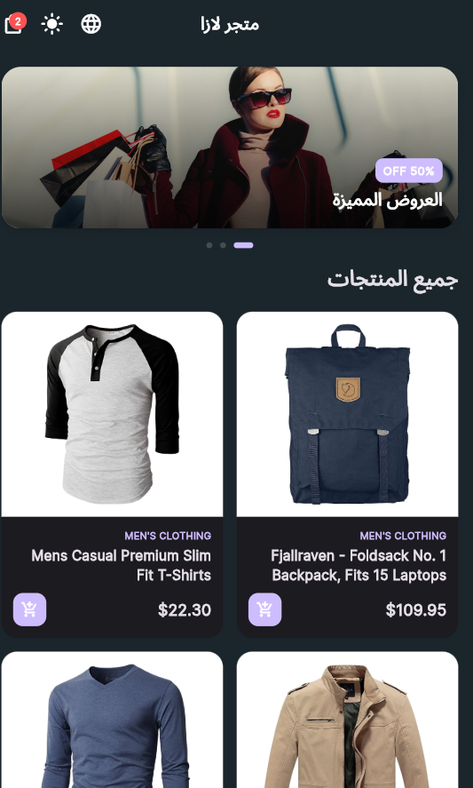 | 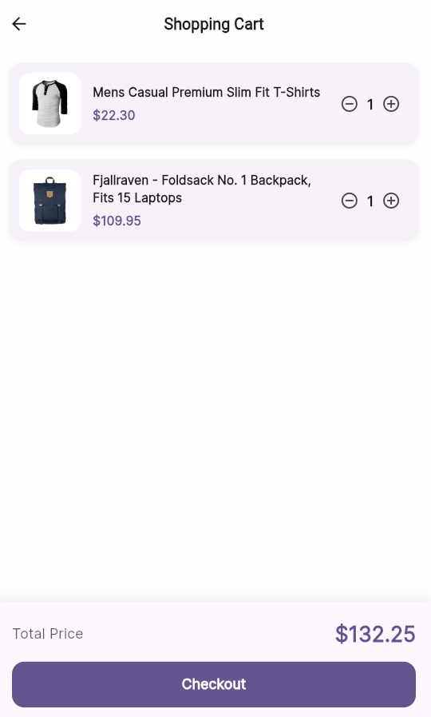 | 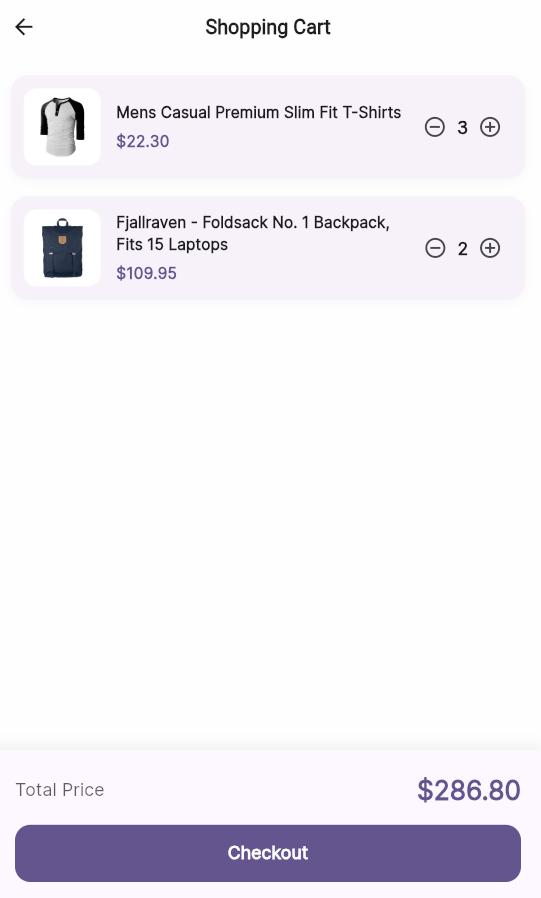 | 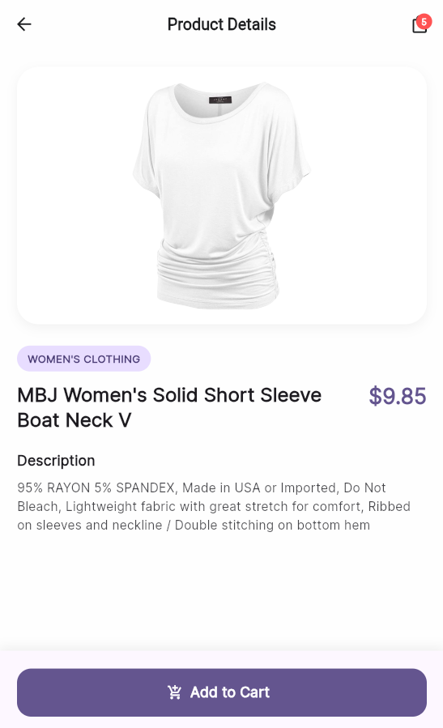 |

---

## ✨ Key Features

- 🔐 **Sign Up & Account Validation**: Interactive sign-up user interface with form validation and alert dialogs.
- 🛍️ **Responsive Product Catalog**: Adaptive GridView that dynamically adjusts column counts and aspect ratios based on screen size.
- 🖼️ **Promotional Banner Carousel**: Interactive `PageView` promotional carousel at the top of the home screen.
- 🔍 **Rich Product Details**: High-resolution image preview with smooth `Hero` transitions, color/size selection, and customer reviews.
- 🛒 **Full Shopping Cart System**: Real-time state management for adding/removing items, adjusting quantities, calculating subtotal, tax, and total price, and managing empty cart states.
- 🌗 **Dynamic Theme Switching (Light / Dark)**: Instant theme toggling backed by `SharedPreferences` local storage.
- 🌐 **Multi-Language & Localization (EN / AR)**: Full internationalization supporting English and Arabic with automatic layout direction switching (LTR / RTL).
- 💻 **Cross-Platform & Web Support**: Enhanced web scrolling and mouse-drag gestures using a custom `MaterialScrollBehavior`.

---

## 🛠️ Tech Stack & Dependencies

| Technology / Library | Purpose |
| :--- | :--- |
| **Flutter & Dart** | Core framework and programming language |
| **flutter_bloc** (`Bloc` & `Cubit`) | Predictable state management and separation of business logic from UI |
| **dio** | Powerful HTTP client for fetching product catalog data from REST API |
| **shared_preferences** | Local device storage for user preferences (Theme & Locale persistence) |
| **equatable** | Simplifies state comparison in BLoC |
| **intl & flutter_localizations** | Internationalization and multi-language support (English & Arabic) |
| **google_fonts** | Typography and custom font styling |

---

## 🏗️ Architecture & Project Structure

The project follows **Clean Architecture & BLoC Pattern** principles:

```text
lib/
├── blocs/               # BLoC & Cubit state management (Theme, Cart, Product, Locale)
│   ├── cart/            # CartBloc, CartEvent, CartState
│   ├── locale/          # LocaleCubit
│   ├── product/         # ProductCubit, ProductState
│   └── theme/           # ThemeBloc, ThemeEvent, ThemeState
├── l10n/                # Localization files (AR / EN)
│   ├── app_localizations.dart
│   ├── app_localizations_ar.dart
│   └── app_localizations_en.dart
├── models/              # Data models (ProductModel, CartItemModel)
├── screens/             # Primary Application Screens
│   ├── sign_up_screen.dart
│   ├── home_screen.dart
│   ├── product_details_screen.dart
│   └── cart_screen.dart
├── services/            # API Services & Cache management (ProductService, CacheHelper)
├── widgets/             # Reusable UI Components (ProductCard, CartItemTile, BannerPageView)
└── main.dart            # Application Entry Point & MultiBlocProvider setup
```

---

## 🚀 Getting Started

Follow these steps to set up and run the project locally:

1. **Clone the Repository:**
   ```bash
   git clone https://github.com/your-username/laza_shop_app.git
   cd laza_shop_app
   ```

2. **Install Dependencies:**
   ```bash
   flutter pub get
   ```

3. **Run the Application:**
   ```bash
   flutter run
   ```

4. **Run on Web Browser:**
   ```bash
   flutter run -d chrome
   ```

---

## 📄 License

This project is licensed under the [MIT License](LICENSE).
